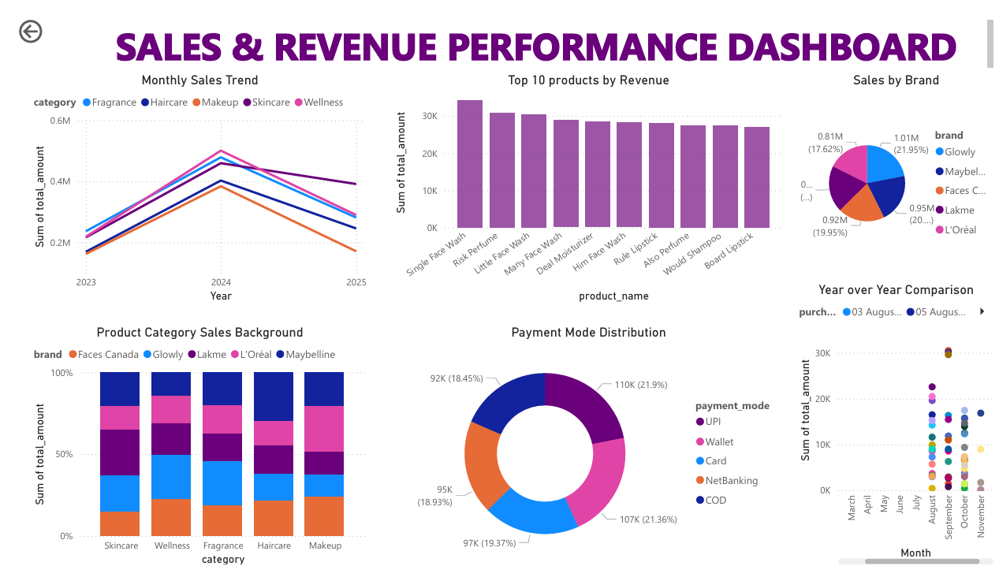
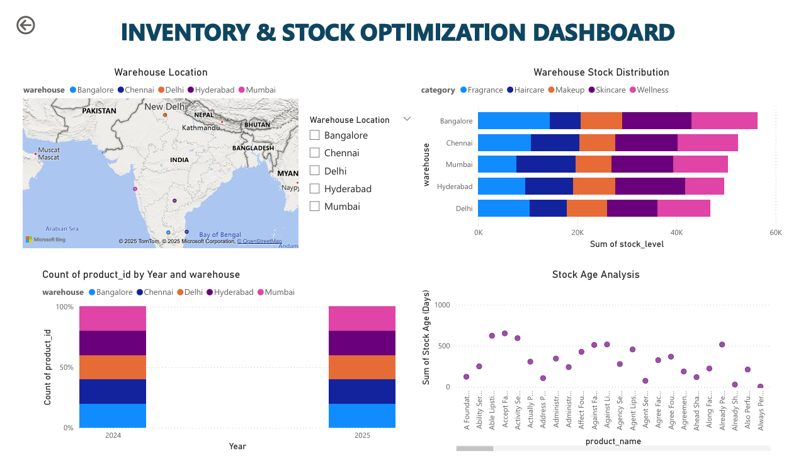
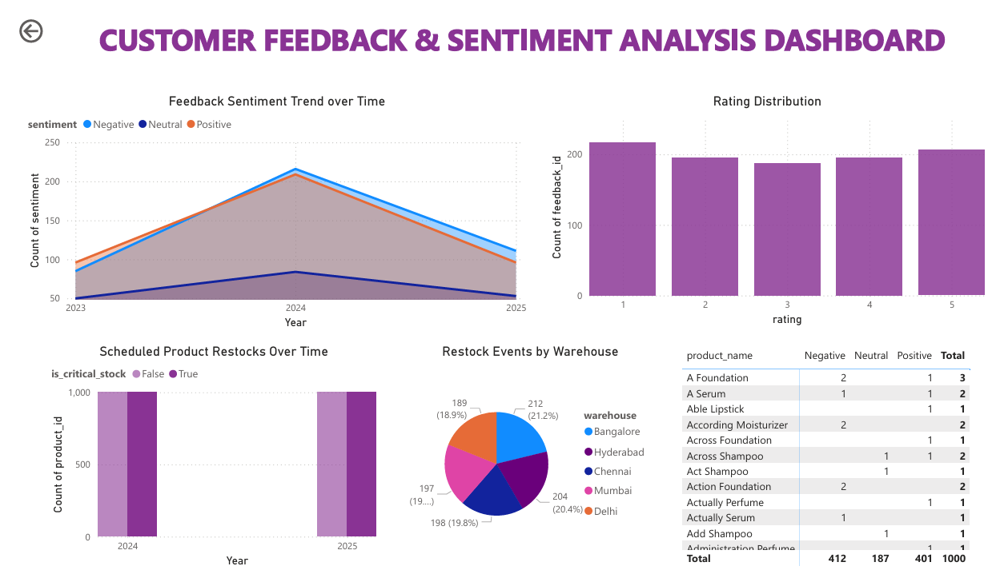
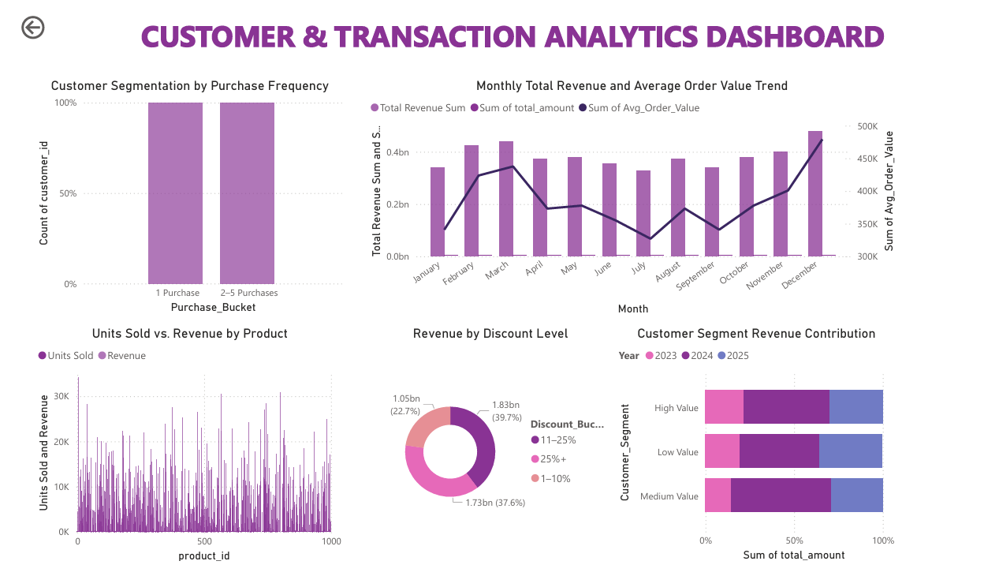
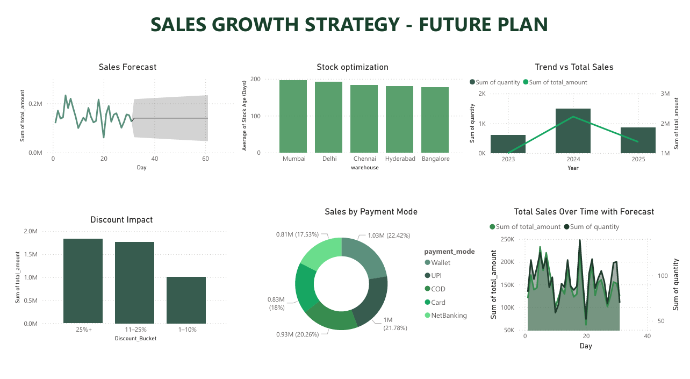

# 💄 Beauty & Brains: Empowering Nykaa's Next Chapter Beyond the Mirror

A strategic data analytics and CRM implementation project for **Nykaa**, blending **business intelligence, customer engagement, and operational excellence** using **Salesforce CRM** and **Power BI**.

**Author:** Lakshmi Meena Manivannan  
**Course:** MSc in Data Analytics (MSCDAD)  
**Institution:** National College of Ireland

---

## 📌 Project Summary
This project addresses Nykaa’s key business challenges through a dual implementation of:
- **Salesforce CRM** → customer lifecycle management, segmentation, and feedback integration  
- **Power BI Dashboards** → real-time analytics across sales, inventory, and customer sentiment

The solution is designed to **scale with Nykaa’s growth**, improve **customer retention**, and **optimize supply chain operations**.

---

## 🎯 Objectives
- Unify fragmented customer data across channels  
- Improve operational efficiency with real-time analytics  
- Enable strategic expansion into Tier 2 / Tier 3 markets  
- Enhance customer experience via personalized engagement

---

## 🧠 Business Context
Nykaa is a leading Indian **beauty & lifestyle retailer** with a strong omni-channel presence, targeting **Gen Z, urban millennials, and beauty enthusiasts**, offering **200k+ products** from **2k+ brands**.

---

## 🛠️ Technologies Used

| Technology        | Purpose                                      |
|------------------|----------------------------------------------|
| **Salesforce CRM** | Customer profiling, feedback, campaigns      |
| **Power BI**       | Business Intelligence dashboards             |
| **MongoDB**        | Centralized data repository                  |
| **Node.js**        | REST API integration                         |
| **AWS S3**         | Data staging / transformations               |
| **Mockaroo**       | Synthetic data generation                    |

---

## 🧱 Architecture Overview
- **Data Sources:** Website, Mobile App, Physical Stores  
- **Storage:** MongoDB, Salesforce  
- **ETL:** MuleSoft (batch) + REST APIs  
- **Analytics:** Power BI dashboards  
- **Presentation:** Salesforce Lightning UI + Power BI visuals

---

## 📊 Dashboards

### Sales & Revenue Performance Dashboard
Shows monthly sales trends, top products, brand-wise sales, payment distribution, and YoY comparison.  
📸 

### Inventory & Stock Optimization Dashboard
Highlights warehouse stock distribution, stock age analysis, and product availability across locations.  
📸 

### Customer Feedback & Sentiment Analysis Dashboard
Analyzes customer sentiment trends, ratings distribution, and restock events.  
📸 

### Customer & Transaction Analytics Dashboard
Covers customer segmentation, purchase frequency, revenue by discount level, and segment contributions.  
📸 

### Current Business Health – Client View
Provides high-level KPIs: revenue, gross profit, order value, and critical stock.  
📸 

### Sales Growth Strategy – Future Plan
Forecasts sales, evaluates discount impact, and shows stock optimization and payment mode split.  
📸 

---

## 🧩 Data & Assumptions
- Data is synthetic/anonymized (e.g., generated via **Mockaroo**); no PII included.  
- PBIX contains model & visuals; raw data not included publicly (academic demo).  
- If you need to regenerate data, document steps in `data/README.md`.

---

## 🔧 How to Open & Explore
1. Install **Power BI Desktop** (latest).  
2. Open `powerbi/BIBA_Nykaa_Sales.pbix`.  
3. If prompted, point data sources to your local files (or use embedded model).  
4. Refresh & explore pages/filters.

---

## 🔄 Continuous Improvement
- **SWOT Analysis** to track internal strengths & external threats  
- **PDCA cycle** for iterative improvement: Plan → Do → Check → Act

---

## 🚀 Future Roadmap
- Curated subscription boxes  
- Expansion into Tier 2/3 cities  
- AR-based virtual try-ons  
- Loyalty-linked wallets  
- B2B gifting / wellness partnerships

---

## 📣 Contact
**Lakshmi Meena Manivannan** — feel free to open an issue for questions.

---

## 📂 Repository Structure
